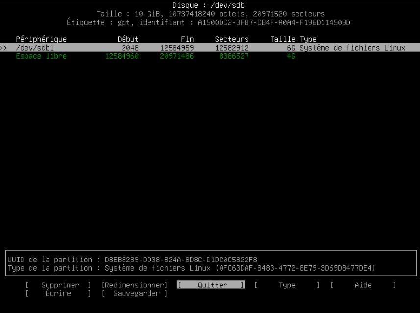
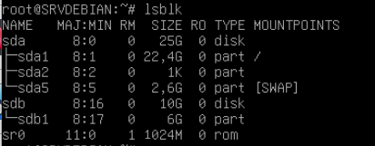
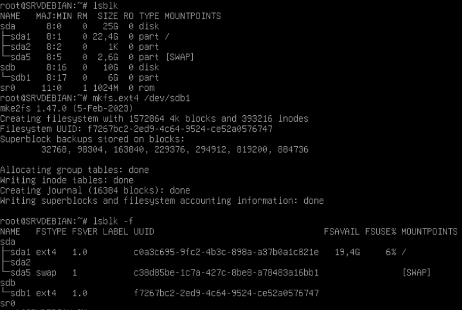
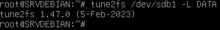
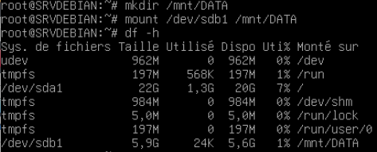
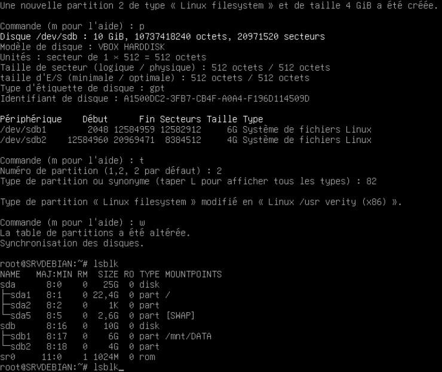
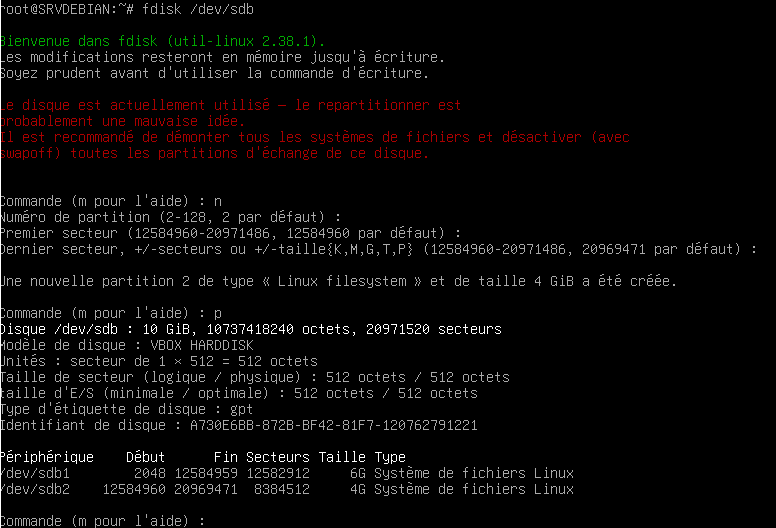
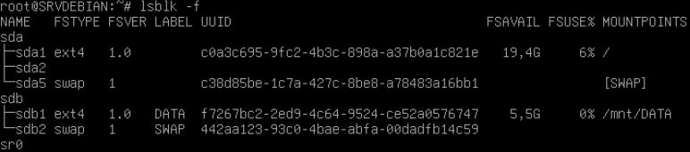

# Checkpoint 1 - Exercice 1
## Partition DATA
 **lsblk** : est utilisée pour répertorier des informations sur tous les périphériques de bloc disponibles.

 **cfdisk /dev/sdb**
Affiche une console pour créer des partitions sur le disque sdb

Sélectionner ensuite le type de partitionnement **"gpt"** >
Puis **"Nouvelle partition"** >
Tapez **6G** >
Choisir **"Ecrire"**, valider et quitter **cfdisk**



Refaire ``` lsblk``` pour véritifier qu'une partition sdb1 a bien été créé    



Formater le disque avec le système de fichier ext4 :  
```mkfs.ext4 /dev/sdb1```   



Changer le label de sb1 par DATA :
tune2fs /dev/sb1 -L DATA



Créer ensuite un dossier DATA dans /mnt : ```mkdir /mnt/DATA ```  
Choisir comme point de montage le /DATA précédemment créé :    
``` mount /dev/sdb1 /mnt/DATA```  

Entrez  ``` df -h``` pour véritifier qu'une partition sdb1 a bien été monté sur /mnt/DATA  



### Partition SWAP

Pour la partition SWAP, nous allons utiliser l'autre méthode : fdisk  
`n` pour créer une nouvelle partition  
`p` pour une partition primaire.  

Utiliser ensuite le numéro par défault ("2") et l'espace par default (fdisk va automatiquement utiliser tout l'espace restant disponible, 4G)  
`t` puis `82` pour choisir le type swap  
`w` pour écrire les modifications  

**modifier le label du disque swap**



### Montage automatique au demarrage
Récupérer l'UUID du disk DATA avec ```lsblk -o NAME,UUID```  



Activer le montage automatique au redémarrage en modifier le fichier de configuration fstab :``` nano /etc/fstab``` 
On retrouve l'UUID, le point de montage, le type, et les configuration par défaults  

Ensuite redémarrer la VM : ``` reboot```  

``` lsblk -f```pour vérifier que le disque sdb1 est toujours monté


